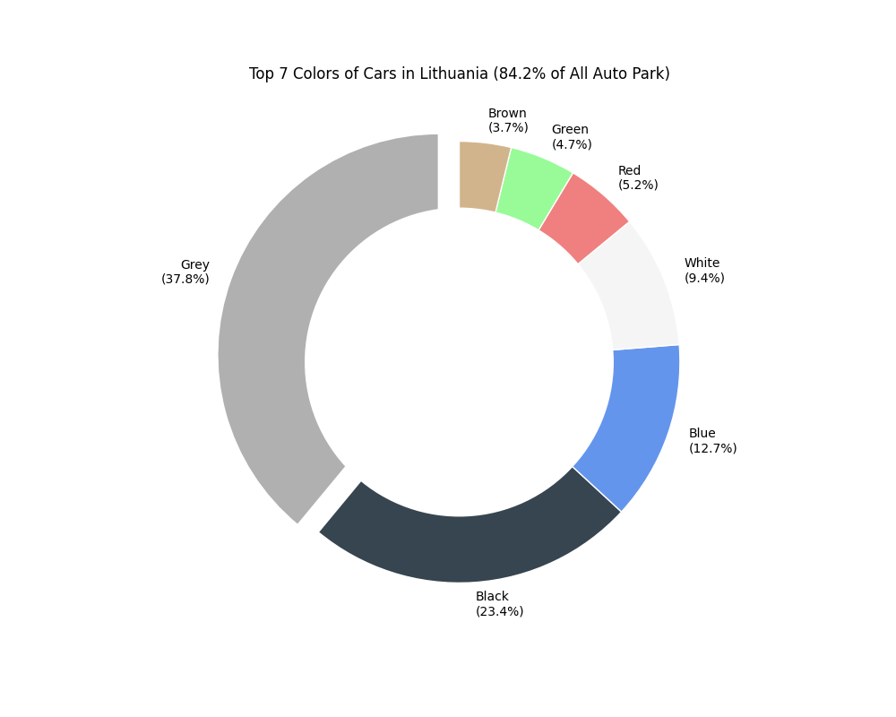

# 🚗 Lithuanian Car Park Analysis

A data analysis project in Python exploring the structure of the Lithuanian car park. This project loads, cleans, and analyzes a 900MB dataset to test hypotheses about car brands and demographics.

## 📈 Key Findings

### Hypothesis 1: German brands dominate the market.
* **Result: Partially Confirmed.**
* While Volkswagen is the single most popular mark, German brands as a whole do not "dominate". They make up **just under half (47-48%)** of the entire car park.
* 

### Hypothesis 2: Cars in Vilnius are significantly newer.
* **Result: Confirmed.**
* The average age of cars in Vilnius is **~14.0 years**, which is significantly lower than in other regions (**~17.5 years**).
* The *Density Plot* (first plot) shows Vilnius has a large peak of new cars (0-10 years) absent elsewhere.
* The *Box Plot* (second plot) confirms the median age in Vilnius (~13 years) is much lower than in other regions (~17 years).
*  

### 📂 Data Source
- **Open dataset about the registered road vehicles (2025-10-01).** Provided by Regitra ®️. Dataset is being updated quarterly within 10 business days after the end of the quarter. [Link to dataset](https://www.regitra.lt/imone/atviri-duomenys/#transporto-priemones)

## 🛠️ Technologies Used

## 📊 Detailed Exploratory Data Analysis (EDA)

Click to expand detailed EDA (9 plots)

### Top 10 Car Marks
* **Insight:** Volkswagen is the most popular single brand (16.6%). However, nearly a third of all cars fall into the "Others" category.
* 

### Top 20 Car Marks (Bar Chart)
* **Insight:** This confirms the top 3: VW (16.6%), Audi (10.6%), and Toyota (9.8%).
* 

### Top 3 Models of Top 3 Brands
* **Insight:** Drilling down, the most popular models for the top brands are VW Passat (82k), Audi A6 (29k), and Toyota Avensis (25k).
* 

### Top 7 Colors
* **Insight:** Grey is the most dominant color. The vast majority (84.2%) of all cars are one of seven colors: grey, black, blue, white, red, green, or brown.
* 

### Car Conditions
* **Insight:** The majority of Lithuanian cars are classified as 'Old' (15-20 years) or 'Very Old' (>20 years).
* 

### Top 15 Oldest & Newest Cars (Average Age)
* **Insight (Oldest):** Audi is among the brands with the oldest average age (20.6 years).
* 
* **Insight (Newest):** This chart reveals a data anomaly: "Moskvich" has an average age of 11.4 years, which is impossible. This highlights an issue in the source data's `production_year` or `first_reg_date` for older models.
* 

### Top 10 Municipalities
* **Insight:** As expected, Vilnius City and Kaunas City have the most registered cars. Interestingly, the *regions* of Vilnius and Kaunas have a similar number of cars as the city of Klaipeda.
* 

